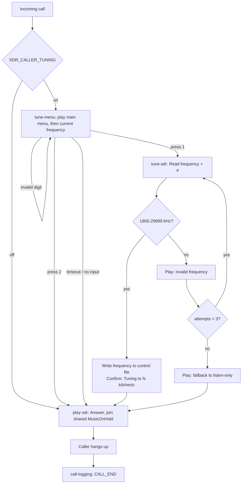

# SIP SDR Service

Original version by Jouni / OH3CUF: <https://codeberg.org/jii/sip-kiwisdr-3699>
— an implementation for KiwiSDR and Web-888 receivers. This fork replaces
that with local USB SDR support (SDRplay/RTL-SDR/PlutoSDR) via SoapySDR.

This standalone Docker project registers a dedicated SIP number, answers
incoming calls, and plays live audio from a local USB SDR — SDRplay
RSP2pro, RTL-SDR, or PlutoSDR, selected via `SDR_DRIVER`. The frequency
and sideband are fully configurable — this project is not tied to any
single band or to one specific radio. Its default host SIP port is 5062
and its RTP range is 11000-11100.

## How it works

`scripts/sdr_stream.py` opens the selected SDR via SoapySDR, tunes it, and
demodulates directly from the raw IQ samples using a small NumPy/SciPy-based
demodulator (`scripts/sdr_demod.py`) — single-sideband (`lsb`/`usb`/`auto`),
narrowband or wideband FM (`nfm`/`wfm`), or AM (`am`), selected via
`SDR_MODE`. Hardware-specific details (antenna selection, gain control, sample-rate
strategy) live in small per-backend adapter modules under
`scripts/sdr_backends/` (`sdrplay.py`, `rtlsdr.py`, `plutosdr.py`) — the
demodulator and the pacing/reconnect logic around it are identical
regardless of which backend is active. A Python supervisor paces the
resulting 8kHz PCM for Asterisk, limits buffering to preserve live
latency, emits silence during interruptions, and reconnects automatically
on device errors. Asterisk shares one receiver stream among simultaneous
callers.

The selected SDR must be physically connected to the same Linux host that
runs this Docker container (via USB for SDRplay/RTL-SDR, or via USB or
network for PlutoSDR — see the PlutoSDR note below).

## Listen-only group behavior

The number supports multiple simultaneous listeners. Everyone hears the
same shared live SDR stream. Calls are deliberately not placed in a voice
conference or bridged to each other, and Asterisk explicitly applies
`MUTEAUDIO(in)=on` to every answered channel. A caller's microphone audio
therefore cannot reach the other listeners.

Active calls are assigned to the `sdr-service@sdr-listeners` group.
Inspect the current listener count with:

```bash
make listeners
```

`CALL_START` and `CALL_END` records include `listener_mode=listen_only` and
listener-count information.

## Choosing and setting up a backend

Set `SDR_DRIVER` in `.env` to `sdrplay`, `rtlsdr`, or `plutosdr`. Only the
env vars prefixed for your chosen driver (`SDRPLAY_*`/`RTLSDR_*`/
`PLUTOSDR_*`) are actually read — the others are ignored.

### SDRplay RSP2pro

SDRplay's Linux API is proprietary and gated behind their EULA, so it
can't be fetched automatically by the Dockerfile:

1. Download the Linux SDRplay API installer for the RSP2pro from SDRplay's
   official downloads page (accepting their EULA).
2. Save it as `vendor/sdrplay_api.run`.
3. Find the RSP2pro's USB vendor/product ID with `lsusb`, then install a
   udev rule that creates a stable symlink:

   ```
   # /etc/udev/rules.d/70-sdr-radio.rules
   SUBSYSTEM=="usb", ATTR{idVendor}=="1df7", ATTR{idProduct}=="3010", MODE="0660", GROUP="plugdev", SYMLINK+="sdr-radio"
   ```

   (Confirm the actual vendor/product ID for your unit with `lsusb`.)
   Reload udev rules with `udevadm control --reload && udevadm trigger`.

### RTL-SDR

On Linux, the kernel's built-in `dvb_usb_rtl28xxu` driver commonly
auto-claims RTL-SDR dongles as a DVB-T TV tuner before userspace
(SoapySDR) can access them — this is the single most common RTL-SDR
failure on Linux/Docker hosts. The standard fix is blacklisting that
kernel module, e.g. by adding `blacklist dvb_usb_rtl28xxu` to a file
under `/etc/modprobe.d/` (such as `/etc/modprobe.d/blacklist-rtlsdr.conf`),
then re-plugging the device.

No proprietary installer needed — the `soapysdr0.8-module-rtlsdr` package
handles it. Find your dongle's USB vendor/product ID with `lsusb` and set
up a udev rule the same way as above (adjust the vendor/product ID and,
if you like, the rule filename).

### PlutoSDR

No proprietary installer needed — the Dockerfile builds the SoapySDR
PlutoSDR module from source automatically (Ubuntu doesn't package it).

PlutoSDR's standard USB vendor/product ID is `0456:b673` (Analog
Devices, Inc.) — confirm it with `lsusb`, then install a udev rule the
same way as the other backends:

```
# /etc/udev/rules.d/70-sdr-radio.rules
SUBSYSTEM=="usb", ATTR{idVendor}=="0456", ATTR{idProduct}=="b673", MODE="0660", GROUP="plugdev", SYMLINK+="sdr-radio"
```

Reload udev rules with `udevadm control --reload && udevadm trigger`, then
confirm `/dev/sdr-radio` exists before starting the container.

PlutoSDR also exposes a USB-Ethernet gadget interface (`ip:192.168.2.1`,
commonly used for SSH/web access to its internal Linux) as an
alternative to raw USB, with no USB device node at all. That path isn't
supported by this Docker setup as-is — it would need `network_mode: host`
in `compose.yaml` plus code changes to `scripts/sdr_backends/plutosdr.py`
to pass an explicit hostname to SoapySDR, since Docker's network
isolation blocks the auto-discovery this backend currently relies on. The
udev/raw-USB route above is what this project actually uses.

In all cases, set `SDR_DEVICE` in `.env` if your symlink path differs from
the default `/dev/sdr-radio`.

### Container privileges

The container's entrypoint runs as root (no `USER` directive in the
Dockerfile) because starting `sdrplay_apiService` (when `SDR_DRIVER=sdrplay`)
and accessing USB device nodes need root-level access. Asterisk itself
still drops privilege via `runuser`/`rungroup = asterisk` in
`config/asterisk.conf`, so SIP signaling, RTP media, and the `sdr-stream`
demodulator process it spawns all run unprivileged.

If `SDR_CONNECT` in the logs is immediately followed by a device-open
permissions error, check the udev rule's `MODE`/`GROUP` settings: it's the
unprivileged `asterisk` user that actually opens the device (since Asterisk
drops privilege via `runuser`/`rungroup=asterisk` before spawning the
`sdr-stream` process), so that user's group membership needs to match the
`GROUP` the rule assigns to the device node. This applies to all three
backends, not just SDRplay.

## Configure

```bash
cp .env.example .env
```

Edit `.env` and supply:

```dotenv
SIP_SERVER=YOUR_SIP_SERVER
SIP_NUMBER=YOUR_SIP_NUMBER
SIP_AUTH_NAME=YOUR_AUTH_USERNAME
SIP_PASSWORD=YOUR_PASSWORD
SDR_DRIVER=rtlsdr
SDR_FREQUENCY_KHZ=3699
SDR_MODE=lsb
```

`SDR_MODE` can also be `auto`, which resolves to LSB below 10,000 kHz and
USB at/above 10,000 kHz (standard ham convention) — useful since this
project isn't tied to one band. `SDR_LOW_CUT_HZ`/`SDR_HIGH_CUT_HZ`
describe the passband edge magnitudes; the resolved sideband determines
the sign automatically, so you don't need to flip them by hand when
retuning across the 10MHz boundary.

`SDR_MODE` can also be `nfm` for narrowband FM — the same modulation as
Marine VHF (e.g. Channel 16 at 156.800 MHz: set `SDR_FREQUENCY_KHZ=156800`)
and ham/PMR FM channels, distinguished from broadcast FM only by a narrower
channel bandwidth and a smaller frequency deviation (how far the carrier
swings from center to encode audio). Unlike `lsb`/`usb`/`auto`, `nfm` ignores
`SDR_LOW_CUT_HZ`/`SDR_HIGH_CUT_HZ` and instead reads `SDR_FM_DEVIATION_HZ`
and `SDR_FM_CHANNEL_BANDWIDTH_HZ` (defaults: 5000 and 16000, matching Marine
VHF's standard 16kHz-bandwidth narrowband FM, ITU designator 16K0F3E).
Optional `SDR_SQUELCH_DB` mutes output below a
power threshold (unset by default — tune by ear/eye during bring-up, since
the right value depends on antenna/gain/hardware); `SDR_SQUELCH_HANG_MS`
(default 200) keeps audio open briefly after signal drops, to avoid chatter
at the threshold. Optional `SDR_FM_DEEMPHASIS_US` applies a de-emphasis
filter if your source pre-emphasizes audio (unset/flat by default, since
this varies by radio/standard for two-way FM).

`SDR_MODE` can also be `wfm` for broadcast-style wideband FM (e.g. tuning
to a normal FM radio station like Yle Suomi at 94.0MHz). It shares the
same `SDR_FM_DEVIATION_HZ`/`SDR_FM_CHANNEL_BANDWIDTH_HZ`/
`SDR_FM_DEEMPHASIS_US` env vars as `nfm`, but with different defaults:
75000 Hz deviation, 200000 Hz channel bandwidth, and a real default
de-emphasis of 50µs (EU/Finland broadcast standard — override
`SDR_FM_DEEMPHASIS_US` to 75 for US-style stations). Unlike `nfm`, whose
de-emphasis is left flat by default since two-way FM standards vary,
broadcast FM's de-emphasis is standardized enough by region to default to
a real value. Because broadcast FM's ±75kHz deviation needs a wider raw
IQ sample rate than the narrowband modes, `wfm` requests a different rate
from the SDR (512kHz instead of 128/256kHz) — this is handled
automatically per backend, no extra configuration needed. One gotcha when
switching an existing `.env` to `wfm`: comment out (or update) any
`SDR_FM_DEVIATION_HZ`/`SDR_FM_CHANNEL_BANDWIDTH_HZ` lines left over from
`nfm`. Docker Compose loads `.env` wholesale into the container, so those
values override `wfm`'s wideband defaults for every mode and produce
badly distorted, aliased audio.

`nfm`/`wfm`'s demodulator output is normalized to roughly ±1.0 at full
deviation, unlike `lsb`/`usb`/`am`'s unnormalized raw IQ amplitude
(typically well below 1.0). `SDR_AUDIO_GAIN` therefore defaults to `1.0`
for `nfm`/`wfm` and `20.0` for the other modes — leave it unset (commented
out in `.env.example`) unless you deliberately want to override that
per-mode default.

`SDR_MODE` can also be `am` for amplitude modulation — used by VHF
airband/ATC traffic (118-137MHz) among others, which keeps AM
specifically for its resistance to the capture effect. Unlike
`nfm`/`wfm`, `am` ignores `SDR_FM_*` and instead reads
`SDR_AM_CHANNEL_BANDWIDTH_HZ` (default 25000, covering both 8.33kHz and
25kHz airband channel spacing). `SDR_SQUELCH_DB`/`SDR_SQUELCH_HANG_MS`
apply here too and are particularly useful for ATC's bursty
transmissions.

### Quick reference: example `.env` settings by frequency

| What you want to hear | `SDR_MODE` | `SDR_FREQUENCY_KHZ` | Anything else to set |
|---|---|---|---|
| Marine VHF Ch16 — distress/calling (156.800MHz) | `nfm` | `156800` | defaults already match this |
| Ham/PMR narrowband FM, any frequency | `nfm` | your frequency | adjust `SDR_FM_DEVIATION_HZ`/`SDR_FM_CHANNEL_BANDWIDTH_HZ` if your channel isn't the 5000/16000 Hz default |
| FM broadcast radio (e.g. 107.6MHz) | `wfm` | `107600` | comment out any `SDR_FM_DEVIATION_HZ`/`SDR_FM_CHANNEL_BANDWIDTH_HZ` left over from `nfm` — see the gotcha above |
| VHF airband distress (e.g. 121.5MHz) | `am` | `121500` | set `SDR_AM_CHANNEL_BANDWIDTH_HZ=8330` if your region uses 8.33kHz channel spacing instead of 25kHz |
| Ham HF SSB below 10MHz (e.g. 80m) | `lsb` (or `auto`) | `3699` | |
| Ham HF SSB at/above 10MHz (e.g. 20m) | `usb` (or `auto`) | `14074` | |

`auto` resolves to LSB below 10,000kHz and USB at/above, so either HF row
above works without changing `SDR_MODE` when retuning across that
boundary. Every row here is real-hardware verified (via PlutoSDR) except
the HF SSB examples, which predate this project's SDR-agnostic backend
support.

### Caller-driven frequency tuning (optional IVR)

By default, `SDR_FREQUENCY_KHZ` and `SDR_MODE` are set once at startup and never change. Set `SDR_CALLER_TUNING=on` in `.env` to enable an optional interactive voice response (IVR) menu that lets callers retune the receiver by phone. This feature is restricted to ham HF SSB only (`lsb`/`usb`/`auto` mode) and works only with single-sideband modulation modes, not with FM or AM.

**Important:** There is only one physical SDR tuner, so retuning is a shared party-line — whoever dials a new frequency changes what all currently-connected listeners hear.

Example `.env`:

```
SDR_MODE=auto
SDR_FREQUENCY_KHZ=3699
SDR_CALLER_TUNING=on
```

Example call flow, starting from the settings above:

1. Call in. You hear "Please select what you want to do. Press 1 to tune the radio to a ham frequency. Press 2 to listen to the currently tuned frequency."
2. Press `1`.
3. You hear "Please enter the frequency in kilohertz, followed by the pound key."
4. Dial `14074#` (20m USB — any value 1800–29999 works, and can be on either side of the 10MHz LSB/USB boundary regardless of the current frequency).
5. You hear "Tuning to fourteen thousand and seventy four kilohertz" and are then connected — now listening on 20m USB. Anyone else already on the call hears the same switch happen live, with no dropout.
6. A caller who instead presses `2` (or waits out the menu without pressing anything) hears "Current frequency is..." followed by whatever is currently tuned, then joins listening — no tuning capability, just like `SDR_CALLER_TUNING=off`'s normal behavior.

An out-of-range entry (e.g. `99999#`) plays "That frequency is not valid..." and reprompts, up to 3 attempts before falling back to listen-only automatically.



Caller-driven tuning uses seven custom prompt audio files, already committed in `config/sounds/custom/` so the feature works out of the box — re-record or re-generate them with your own TTS tooling if you want to change the wording or language. All are 8kHz mono WAV files (or any format Asterisk's sound-file conventions accept):

- **`sdr-main-menu`** — "Please select what you want to do. Press 1 to tune the radio to a ham frequency. Press 2 to listen to the currently tuned frequency."
- **`sdr-current-frequency`** — "Current frequency is" (plays automatically when a caller enters the tune menu, right after the main menu, before the spoken frequency number and `sdr-kilohertz`).
- **`sdr-enter-frequency`** — "Please enter the frequency in kilohertz, followed by the pound key."
- **`sdr-invalid-frequency`** — "That frequency is not valid. Please enter a frequency between 1800 and 29999 kilohertz."
- **`sdr-tuning-to`** — "Tuning to" (this phrase is followed by the frequency number and `sdr-kilohertz`).
- **`sdr-kilohertz`** — "kilohertz".
- **`sdr-fallback-listen`** — "We could not understand that. Switching to listen-only mode."

Frequency entry is limited to 1800–29999 kHz (ham HF SSB band), is terminated with the `#` key, and supports up to 3 input attempts before falling back to listen-only mode.

Build and deploy as usual (`make up`). If you replace a prompt file and it's missing or unreadable at build/run time, the build still succeeds but callers see an Asterisk warning message instead of the prompt. With `SDR_CALLER_TUNING=off` (the default), this feature is completely disabled and the receiver behaves as before. Enabling it also requires `SDR_MODE` to be `lsb`, `usb`, or `auto` — `docker-entrypoint.sh` refuses to start otherwise.

The project is SIP-provider independent. Set `SIP_SERVER`, the account
fields, ports, and any external address to values supplied by your own
provider and network administrator.

Keep `.env` private. It is ignored by Git.

## Run and verify

```bash
make test
make up
make status
make logs
```

After startup, `pjsip show registrations` should report `Registered`. The
custom receiver source may start immediately when Asterisk loads the
Music-on-Hold class. Its logs include:

```text
SDR_CONNECT ...
SDR_CONNECT_RATE iq_sample_rate_hz=...
SDR_AUDIO_ACTIVE
SDR_DISCONNECTED reason=... retry_seconds=...
```

`SDR_CONNECT_RATE` reports the actual IQ sample rate the device negotiated — useful for confirming `wfm` actually got its wider rate during bring-up.

Test receiver access independently (20-second default timeout, overridable
via `SDR_TEST_TIMEOUT_SECONDS`):

```bash
make test-stream
```

This command succeeds only after receiving at least one complete PCM audio
frame and prints `RECEIVER_TEST_OK`. It opens a temporary additional device
stream and closes it immediately after the test. SDRplay's API service can
support this second, simultaneous stream open while the main service is
already running. RTL-SDR and PlutoSDR typically claim the USB device
exclusively, so for those two backends, stop the main service first
(`make down`) before running `make test-stream`, or the open will fail
with a busy/in-use error.

Every call produces matching records containing caller information and
duration:

```text
CALL_START service=rtlsdr id=...
CALL_END service=rtlsdr id=... total_seconds=... answered_seconds=...
```

Show only call records with `make calls`.

These records include the caller's telephone number and, when supplied by
the SIP provider, the caller's name. Treat the logs as personal data:
restrict access, retain them only as long as needed, and follow the privacy
requirements that apply in your jurisdiction.

If `SDR_MODE=auto`, `CALL_START`/`CALL_END` log lines show `mode=auto`
rather than the resolved sideband — check the container logs' `SDR_CONNECT`
line for the actual LSB/USB choice made at startup.

## Failure behavior

- A device error does not terminate active calls. Callers hear silence
  while the supervisor reconnects.
- Audio older than `SDR_STALE_SECONDS` causes a reconnect (device
  close/reopen).
- Reconnect delay grows from `SDR_RETRY_INITIAL_SECONDS` to
  `SDR_RETRY_MAX_SECONDS`.
- A jitter buffer absorbs small timing variations. If it reaches
  `SDR_BUFFER_MAX_MS`, one resynchronization returns it to
  `SDR_BUFFER_TARGET_MS`; this avoids repeated tiny sample drops.
- All callers share one receiver channel and hear the same point in the
  live stream.
- Caller microphone audio is muted inbound and callers are never bridged
  together.

`Spawn extension ... exited non-zero` immediately after `Stopped music on
hold` is Asterisk's normal hangup path: `MusicOnHold()` returns `-1` when
the caller disconnects. It does not indicate a failed call.

## Networking

If signaling works but audio does not, set `EXTERNAL_ADDRESS` to the Docker
host's public IP or hostname and forward these defaults to the Docker host:

- UDP/TCP 5062 for SIP
- UDP 11000-11100 for RTP

Only change `RTP_START` and `RTP_END` together. Docker Compose publishes
the same range that Asterisk advertises.

## Responsible operation

Use a dedicated SIP account. Stop the project with `make down` when it
should not answer calls.
